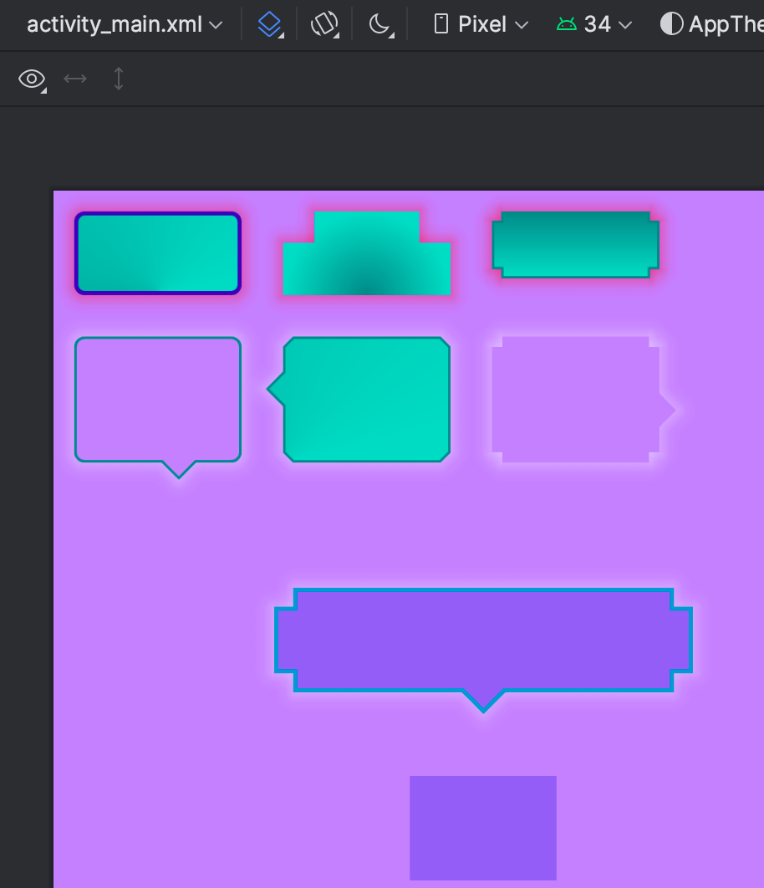

# shapeable

ShapeableDrawable/ShapeableLinearLayout/ShapeableFrameLayout 可自定义 背景色/渐变背景/形状/阴影/描边
   


 

## 引入 

``` groovy
repositories {
    maven { url "https://gitee.com/ezy/repo/raw/cosmo/"}
}
dependencies {
    implementation "me.reezy.cosmo:shapeable:0.10.0"
}
```

## 属性

```xml 
    <declare-styleable name="ShapeableDrawable">
    <!-- 背景色 -->
    <attr name="backgroundTint" />

    <!-- 描边 -->
    <attr name="strokeColor" />
    <attr name="strokeWidth" />

    <!-- 形状 -->
    <attr name="shapeAppearance" />
    <attr name="shapeAppearanceOverlay" />

    <!-- 角大小 -->
    <attr name="cornerSize" /> 
    <!-- 角类型 -->
    <attr name="cornerType" format="enum">
        <enum name="rounded" value="0"/>
        <enum name="cut" value="1"/>
        <enum name="concave" value="2"/>
    </attr> 
    <!-- 角位置 -->
    <attr name="cornerPosition" format="enum">
        <enum name="all" value="0"/>

        <enum name="tl" value="1"/>
        <enum name="tr" value="2"/>
        <enum name="bl" value="3"/>
        <enum name="br" value="4"/>

        <enum name="top" value="5"/>
        <enum name="bottom" value="6"/>
        <enum name="left" value="7"/>
        <enum name="right" value="8"/>

        <enum name="tl_br" value="9"/>
        <enum name="bl_tr" value="10"/>

        <enum name="tl_none" value="11"/>
        <enum name="tr_none" value="12"/>
        <enum name="bl_none" value="13"/>
        <enum name="br_none" value="14"/>
    </attr>


    <!-- 阴影 -->
    <attr name="shadowColor" format="color" />
    <attr name="shadowRadius" format="dimension" />
    <attr name="shadowOffsetX" format="dimension" />
    <attr name="shadowOffsetY" format="dimension" />

    <!-- 气泡箭头 -->
    <attr name="arrowSize" format="dimension" />
    <attr name="arrowOffset" format="dimension" />
    <attr name="arrowEdge" format="enum">
        <enum name="left" value="1" />
        <enum name="top" value="2" />
        <enum name="right" value="3" />
        <enum name="bottom" value="4" />
    </attr>
    <attr name="arrowAlign" format="enum">
        <enum name="start" value="1" />
        <enum name="center" value="2" />
        <enum name="end" value="3" />
    </attr>


    <!--背景渐变类型-->
    <attr name="gradientType" format="enum">
        <enum name="linear" value="0" />
        <enum name="radial" value="1" />
        <enum name="sweep" value="2" />
    </attr>
    <!--渐变中心点X坐标（0-1）-->
    <attr name="gradientCenterX" format="float" />
    <!--渐变中心点Y坐标（0-1）-->
    <attr name="gradientCenterY" format="float" />
    <!--渐变半径-->
    <attr name="gradientRadius" format="dimension" />
    <!--渐变方向-->
    <attr name="gradientOrientation" format="enum">
        <enum name="TOP_BOTTOM" value="0" />
        <enum name="TR_BL" value="1" />
        <enum name="RIGHT_LEFT" value="2" />
        <enum name="BR_TL" value="3" />
        <enum name="BOTTOM_TOP" value="4" />
        <enum name="BL_TR" value="5" />
        <enum name="LEFT_RIGHT" value="6" />
        <enum name="TL_BR" value="7" />
    </attr>
    <!--渐变开始颜色-->
    <attr name="gradientStartColor" format="color" />
    <!--渐变中心颜色-->
    <attr name="gradientCenterColor" format="color" />
    <!--渐变结尾颜色-->
    <attr name="gradientEndColor" format="color" />
</declare-styleable>
``` 
## 用法

使用 `ShapeableFrameLayout / ShapeableLinearLayout`
            
```xml
<me.reezy.cosmo.shapeable.ShapeableFrameLayout
    android:layout_width="80dp"
    android:layout_height="40dp"
    android:layout_margin="10dp"
    android:clickable="true"
    android:gravity="center"
    app:cornerSize="5dp"
    app:cornerType="rounded"
    app:shadowColor="#40ff0000"
    app:shadowRadius="10dp"
    app:shapeAppearance="@style/ShapeAppearance.Material3.Corner.Full"
    app:strokeColor="@color/teal_700"
    app:strokeWidth="1dp" />
```

使用 `drawable` 可用于普通 `View`

```xml 
<View
    android:layout_width="200dp"
    android:layout_height="50dp"
    android:layout_columnSpan="3"
    android:layout_gravity="center_horizontal"
    android:layout_margin="10dp"
    android:layout_marginTop="50dp"
    android:background="@drawable/shapeable" />
```

`shapeable.xml`

```xml
<?xml version="1.0" encoding="utf-8"?>
<me.reezy.cosmo.shapeable.ShapeableDrawable xmlns:android="http://schemas.android.com/apk/res/android"
    xmlns:app="http://schemas.android.com/apk/res-auto"
    xmlns:tools="http://schemas.android.com/tools"
    app:arrowAlign="center"
    app:arrowEdge="bottom"
    app:arrowSize="10dp"
    app:backgroundTint="#400000cc"
    app:cornerSize="10dp"
    app:cornerType="concave"
    app:shadowColor="#40ffffff"
    app:shadowRadius="10dp"
    app:strokeColor="@android:color/holo_blue_dark"
    app:strokeWidth="2dp" />
```

## LICENSE

The Component is open-sourced software licensed under the [Apache license](LICENSE).